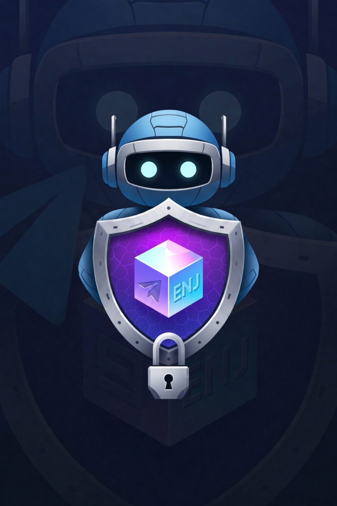

<p align="center">
  
</p>

# Bouncer

Token-gated Telegram communities via [Enjin](https://enjin.io) NFTs.

Bouncer sits in your Telegram group as an admin and only lets people stay if
they hold the NFTs you've configured. Members link their Enjin wallet once,
Bouncer checks ownership against your rules, and anyone who doesn't qualify
(or sells their tokens later) gets removed automatically.

## Features

- **Wallet verification** — members link their Enjin wallet through a QR code
  flow (`/verify`), no seed phrases or signatures pasted into chat
- **Flexible rules** — gate on a whole collection, a specific token, or a
  minimum balance; add multiple rules per group
- **Automatic enforcement** — new members get a time window to verify before
  they're kicked; repeat offenders get banned
- **Periodic re-checks** — ownership is re-verified on an interval you
  control, so selling the NFT means losing access
- **Web dashboard** — manage groups and rules, browse members, trigger manual
  re-checks, and review a full audit log of every action the bot took
- **Self-hostable** — two Docker containers and a Postgres database

## How it works

1. Add the bot to your group and promote it to admin.
2. As the group admin, link your own wallet and set up rules with `/setup`
   and `/addrule` (or use the dashboard).
3. When someone joins, Bouncer gives them a set time to verify. They tap
   the bot, scan a QR code with the Enjin wallet app, and approve the link.
4. Bouncer checks their wallet against the group's rules. Holders stay,
   everyone else is removed when the deadline passes.
5. A background job re-checks all verified members on a schedule
   (configurable per group with `/setinterval`), so access stays in sync
   with actual ownership.

### Bot commands

| Command        | Who          | What it does                                              |
| -------------- | ------------ | --------------------------------------------------------- |
| `/verify`      | members      | Link an Enjin wallet via QR code                          |
| `/status`      | members      | Show your wallet link and verification state              |
| `/unlink`      | members      | Disconnect your wallet                                    |
| `/setup`       | group admins | Register the group and sync admins                        |
| `/addrule`     | group admins | Add an NFT requirement (collection / token / min balance) |
| `/rules`       | group admins | List the group's active rules                             |
| `/removerule`  | group admins | Delete a rule                                             |
| `/setinterval` | group admins | Change the re-check frequency                             |

## Self-hosting

### What you need

- Node.js 20+ (development) or Docker (production)
- A PostgreSQL database — the production compose file ships one, so you only
  need to bring your own for development or if you prefer a managed provider
- A Telegram bot token from [@BotFather](https://t.me/BotFather)
- Access to the [Enjin Platform](https://platform.enjin.io) GraphQL API

### Telegram setup

Create a bot with @BotFather, then:

- `/setprivacy` → **Disable** — the bot needs to see group messages to catch
  unverified members
- `/setdomain` → your dashboard domain — required for the Telegram login
  widget on the dashboard

The bot must be a group admin with permission to ban users.

### Configuration

```bash
cp .env.example .env
```

Fill in the values. The important ones:

| Variable                                | Purpose                                                                                             |
| --------------------------------------- | --------------------------------------------------------------------------------------------------- |
| `DATABASE_URL`                          | Postgres connection string                                                                          |
| `BOT_TOKEN`                             | Token from @BotFather                                                                               |
| `BOT_USERNAME`                          | Bot username without the `@`                                                                        |
| `ENJIN_API_URL`                         | Enjin Platform GraphQL endpoint                                                                     |
| `ENJIN_API_TOKEN`                       | Optional token for authenticated Enjin requests                                                     |
| `SESSION_SECRET`                        | Signs dashboard sessions — generate a long random hex string                                        |
| `POSTGRES_PASSWORD`                     | Password for the bundled Postgres container (skip when using an external database)                  |
| `SMTP_HOST` / `SMTP_USER` / `SMTP_PASS` | Outgoing mail for the contact form                                                                  |
| `BOUNCER_COLLECTION_ID`                 | Optional: restrict _adding the bot_ to holders of this collection. Leave blank to let anyone use it |

The full list with comments is in [.env.example](.env.example). Startup fails
fast if a required variable is missing.

### Run it

Development (bot, dashboard, and CSS watcher together):

```bash
npm ci
npm run db:migrate
npm run dev
```

Production, with Docker (set `POSTGRES_PASSWORD` in `.env` first and point
`DATABASE_URL` at the bundled database: `postgres://bouncer:<POSTGRES_PASSWORD>@postgres:5432/bouncer`):

```bash
docker compose -f docker-compose.prod.yml up -d --build
docker exec tgbot-dashboard node dist/shared/migrate.js
```

This starts three containers: `tgbot-postgres` (internal only, data in a named
volume), plus `tgbot-bot` (long-polling Telegram bot) and `tgbot-dashboard`
(Express server on port 3000) built from the same image. Put a reverse proxy
with TLS in front of the dashboard — the Telegram login widget won't work
without HTTPS on the domain you registered with `/setdomain`. And schedule
`pg_dump` backups from day one; the bundled database is only as safe as the
disk it lives on.

Keep the host clock NTP-synced (the default on cloud VPSes). Dashboard login
rejects Telegram auth blobs older than 5 minutes, so a host clock running more
than a few minutes fast makes every login fail with "Invalid Telegram login".

## Architecture

```
┌─────────────┐     ┌───────────────┐
│  tgbot-bot  │     │tgbot-dashboard│
│  (grammY)   │     │ (Express/EJS) │
└──────┬──────┘     └──────┬────────┘
       │                   │
       └───────┬───────────┘
               │
        ┌──────▼──────┐        ┌─────────────────┐
        │  PostgreSQL │        │  Enjin Platform  │
        └─────────────┘        │  (GraphQL API)   │
                               └─────────────────┘
```

Both containers share one database. The bot runs a set of cron jobs
(verification polling, expired-member kicks, periodic ownership re-checks)
guarded by Postgres advisory locks, so running multiple instances won't
double-process anything. Wallet verification goes through the Enjin
Platform's wallet-linking flow; Bouncer never sees private keys.

Heads up if you host the database on a serverless/metered Postgres provider:
the cron jobs query frequently enough that the database never idles, which
defeats auto-suspend billing. A flat-fee instance or self-hosted Postgres is
the better fit.

## Development

```bash
npm run dev            # bot + dashboard + tailwind watcher
npm run dev:bot        # bot only
npm run dev:dashboard  # dashboard only
npm run db:migrate     # apply migrations
npm run build          # compile TypeScript to dist/
npm run css:build      # one-off tailwind build
```

There's a devcontainer config in `.devcontainer/` if you'd rather not
install anything locally. `testscripts/seed-demo.ts` fills a database with
demo data for dashboard development. Setting `ENABLE_DEV_LOGIN="true"` in
your local `.env` adds a passwordless dev login to the dashboard's login
page (never active when `NODE_ENV` is `production`).

## License

Bouncer is released under the [GNU AGPL-3.0](LICENSE).

Copyright (C) 2026 Anass Mokhless
